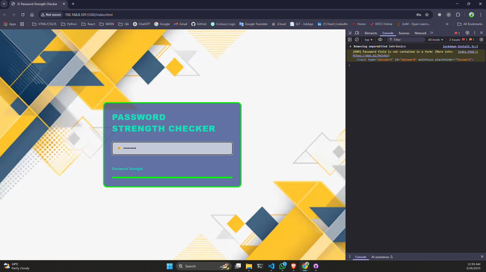

# JS Password Strength Checker



This is a simple **JavaScript Password Strength Checker** that evaluates the strength of a password based on different criteria and provides real-time feedback through a progress bar and border color changes.

## Features
- **Real-time Password Strength Evaluation**: Checks the strength as the user types.
- **Visual Feedback**: Changes progress bar and border color based on password strength.
- **Strength Criteria**:
  - At least **one uppercase letter**
  - At least **one lowercase letter**
  - At least **one numeric digit**
  - At least **one special character** (`@ # $ % ^ & *`)
  - **Minimum 9 characters**
- **Interactive Hover Effect**: Password checker box scales when hovered.
- **Responsive Design**: Works on different screen sizes.

## Technologies Used
- HTML
- CSS
- JavaScript

## Project Structure
```
📂 Password-Strength-Checker
│── index.html  (Main HTML file)
│── style.css   (Styling for the UI)
│── script.js   (JavaScript logic for password checking)
│── image2.avif (Background image)
│── README.md   (Project documentation)
```

## How to Use
1. Open `index.html` in a browser.
2. Type a password in the input field.
3. The password strength will be visually represented:
   - **Brown** → Very weak
   - **Red** → Weak
   - **Gold** → Moderate
   - **Deepskyblue** → Strong
   - **Lime** → Very strong
4. Adjust your password to improve its strength.

## Installation
No installation is required. Simply download the files and open `index.html` in your browser.

## Customization
- Modify `style.css` to adjust colors, fonts, and animations.
- Update `script.js` to change password strength criteria or add additional validation rules.

## Installation & Setup
Clone the repository:
   ```sh
   git clone https://github.com/DilanPramodhya/JS_Password_Strength_Checker.git
   ```
## License
This project is **free to use** and can be modified as per your needs.

## Author
Created by **Dilan Pramodhya** 🚀

